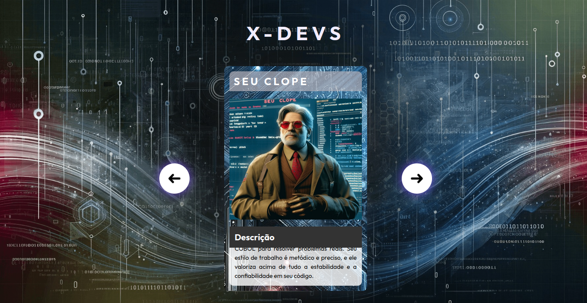

<h1 align="center">🖥️ X-Devs 🖥️</h1>

  

<h3 align="center">Projeto desenvolvido durante a semana do zero ao programador contratado, do Dev em Dobro.<h3>

 

## Tópicos
- [Imagem do projeto](#img)
- [Acesso ao projeto](#acesso)
- [Descrição](#desc)
- [Tecnologias utilizadas](#tec)
- [Status do projeto](#status)  
- [Licença](#license)

 

<h2 id="img">📸 Imagem do projeto</h2>

 

<h2 id="acesso">🔗 Acesso ao projeto</h2>

Clique [aqui](https://fel1324.github.io/X-Devs/) para acessar o projeto!

 

<h2 id="desc">📱 Descrição</h2>

    X-Devs é uma paródia criativa inspirada no icônico grupo de super-heróis da Marvel, os X-Men.

 

<h2 id="tec">🚀 Tecnologias utilizadas</h2>

* HTML e CSS
* Javascript
* Git e Github

 

<h2 id="status">🚧 Status dos projetos</h2>

✔️ Projeto Finalizado

 

<h2 id="license">📝 Licença</h2>

O projeto está sob a licença MIT.